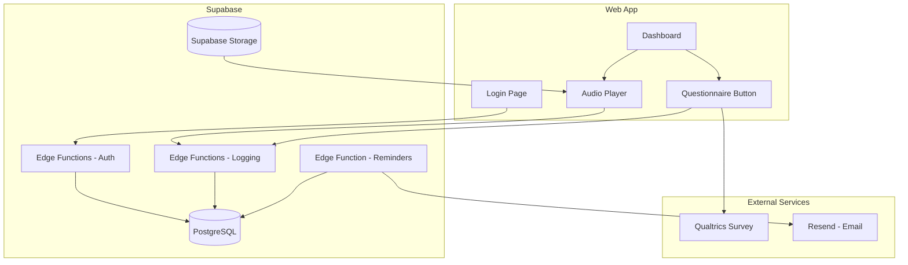

# Meditation Training Website - Implementation Plan

## Architecture Overview



---

## Provider Strategy: Supabase + Resend

**Supabase handles everything except email**: database, storage, auth logic, API (Edge Functions), and scheduled jobs (pg_cron). Supabase has no native transactional email API, so **Resend** (one additional provider) is required for reminder emails. Resend offers 100 free emails/day.


| Need                 | Service                            | Provider               |
| -------------------- | ---------------------------------- | ---------------------- |
| Database             | PostgreSQL                         | Supabase               |
| Auth (email + code)  | Custom DB lookup via Edge Function | Supabase               |
| File storage (audio) | Supabase Storage                   | Supabase               |
| API logic            | Edge Functions                     | Supabase               |
| Scheduled reminders  | pg_cron invokes Edge Function      | Supabase               |
| Email sending        | Resend API                         | Resend (100 free/day)  |
| Hosting              | Vercel or Supabase Storage static  | Vercel free / Supabase |


---

## Data Model

### Users table


| Column        | Type      | Description                      |
| ------------- | --------- | -------------------------------- |
| id            | UUID      | Primary key                      |
| email         | string    | Unique, used for login           |
| personal_code | string    | Unique, used with email for auth |
| created_at    | timestamp |                                  |


### Daily_logs table (or equivalent)


| Column                   | Type                 | Description                            |
| ------------------------ | -------------------- | -------------------------------------- |
| id                       | UUID                 | Primary key                            |
| user_id                  | FK                   | Reference to user                      |
| date                     | date                 | Day (e.g., 2025-02-12)                 |
| meditation_played        | boolean              | Did they play meditation today         |
| meditation_started_at    | timestamp (nullable) | When meditation started                |
| questionnaire_started_at | timestamp (nullable) | When user opened/started questionnaire |
| reminder_sent_at         | timestamp (nullable) | When reminder email was sent           |


### meditation_files table (optional)


| Column     | Type      | Description                      |
| ---------- | --------- | -------------------------------- |
| id         | UUID      | Primary key                      |
| date       | date      | Which day this meditation is for |
| file_url   | string    | S3/Supabase Storage URL          |
| created_at | timestamp |                                  |


---

## Implementation Plan

### Phase 1: Project setup and provider configuration

1. **Initialize project**
   - Create a React + Vite frontend
   - Set up folder structure: `/frontend`, `/supabase/functions` for Edge Functions
   - Add `.env.example` with `VITE_SUPABASE_URL`, `VITE_SUPABASE_ANON_KEY`, `VITE_QUALTRICS_SURVEY_URL`
2. **Configure Supabase**
   - Create Supabase project at supabase.com
   - Run SQL migrations: `users`, `daily_logs`, `meditation_files` tables
   - Enable Storage, create `meditations` bucket (or `audio`), set RLS policies
   - Add Resend API key to Supabase Edge Function secrets (Dashboard > Project Settings > Edge Functions)

### Phase 2: Authentication

1. **Login flow**
   - Single page: two inputs (email, personal_code), one submit button
   - Edge Function `auth-login`: receives `{ email, personal_code }`, queries `users` table via Supabase client
   - If match: sign and return JWT with `user_id` (use Supabase's `createClient` with service role, or `jsonwebtoken` in Edge Function); if no match: return 401
   - No password hashing; codes are pre-populated in DB (admin script or seed)
2. **Session handling**
   - Store JWT in `sessionStorage` or `localStorage`
   - Protected routes: validate JWT on dashboard load; redirect to login if missing/invalid

### Phase 3: Dashboard and meditation player

1. **Dashboard UI**
   - After login, show two buttons: "Play today's meditation" and "Complete questionnaire"
   - Layout: simple, centered, mobile-friendly
2. **Meditation of the day**
   - Edge Function `meditation-today` or direct Supabase query: fetch `meditation_files` where `date = today()` (in app timezone), return signed Storage URL or public URL
   - Frontend: use native `<audio>` element or react-h5-audio-player
   - Resolve "today" in Edge Function using configured timezone (e.g., `America/New_York`)
3. **Logging: meditation**
   - On play (audio `play` event): call Edge Function `logs-meditation-start` with JWT in `Authorization` header
   - Edge Function: verify JWT, upsert `daily_logs` for user+date, set `meditation_played: true`, `meditation_started_at: now()`

### Phase 4: Qualtrics integration

1. **Questionnaire button**
   - Button opens Qualtrics survey URL in new tab: `window.open(import.meta.env.VITE_QUALTRICS_SURVEY_URL, '_blank')`
   - Before opening: call Edge Function `logs-questionnaire-start` with JWT
   - Edge Function: upsert `daily_logs`, set `questionnaire_started_at: now()`
2. **Optional: completion tracking**
   - Qualtrics "End of Survey" redirect to `https://yoursite.com/questionnaire-complete?token=...` — only if needed later

### Phase 5: Email reminder system

1. **Scheduled job (Supabase pg_cron)**
   - Enable `pg_cron` and `pg_net` extensions in Supabase (Dashboard > Database > Extensions)
   - Schedule job to run daily at target hour (e.g., 20:00) via SQL: `cron.schedule('reminder-job', '0 20 * * *', ...)` 
   - Job calls `net.http_post()` to invoke Edge Function `send-reminders` with `Authorization: Bearer <service_role_key>`
   - Edge Function logic: query users who have no `daily_logs` row for today with both `meditation_played` and `questionnaire_started_at` set (or equivalent: missing either)
2. **Email sending (Resend)**
   - Edge Function `send-reminders`: for each user to remind, call Resend API (`POST https://api.resend.com/emails`)
   - Template: "You haven't completed today's meditation and questionnaire. [Link to dashboard]"
   - Upsert `daily_logs` with `reminder_sent_at` after sending to avoid duplicate emails
   - Store `RESEND_API_KEY` in Supabase secrets

### Phase 6: Admin and content management

1. **Meditation file upload**
   - Admin script or Supabase Dashboard: upload to Storage bucket `meditations`, path `YYYY-MM-DD.mp3`
   - Insert row in `meditation_files` with `date` and `file_url` (or use Storage path convention)
2. **User and code management**
   - Seed script or SQL: insert into `users` (email, personal_code). No public registration.

---

## General Developer Guidelines

### Connecting external services

1. **Environment variables**
   - Frontend: `VITE_*` or `NEXT_PUBLIC_*` for Qualtrics URL, API base URL
   - Backend: database connection string, storage credentials, email API key
   - Use `.env.example` with dummy values; never commit real secrets
2. **Qualtrics**
   - Create survey in Qualtrics, copy the distribution link (anonymous or with query params for user id if needed)
   - For "start" logging: log when the user clicks the button that opens Qualtrics (sufficient for "time of start questionnaire compilation")
   - Optional: use Qualtrics "Redirect" in survey flow to your domain for completion tracking
3. **Resend (email)**
   - Sign up at resend.com, verify your sending domain, get API key
   - Add `RESEND_API_KEY` to Supabase Edge Function secrets (Dashboard > Project Settings > Edge Functions)
   - Use simple HTML or plain-text template; include unsubscribe only if required by law (check your jurisdiction)
4. **CORS**
   - Configure backend to allow requests from your frontend origin (e.g., `https://yourdomain.com`)
5. **Time zones**
   - Define "day" and reminder time in one timezone (e.g., `America/New_York`)
   - Store timestamps in UTC; convert for display and for daily cutover logic

### Security notes (minimal per requirements)

- No passwords: acceptable for low-risk, pre-registered users
- Use HTTPS everywhere
- Validate email + code server-side; do not trust client
- Rate-limit login endpoint to prevent brute force on codes

### Suggested tech stack (for LLM implementation)

- **Frontend**: React + Vite
- **Backend**: Supabase Edge Functions (Deno)
- **Database**: Supabase PostgreSQL
- **Hosting**: Vercel (frontend) or Supabase Storage for static site

---

## File structure (reference)

```
/
├── frontend/
│   ├── src/
│   │   ├── pages/
│   │   │   ├── Login.jsx
│   │   │   └── Dashboard.jsx
│   │   ├── components/
│   │   │   └── AudioPlayer.jsx
│   │   ├── api/
│   │   │   └── client.js
│   │   └── App.jsx
│   └── .env.example
├── supabase/
│   ├── functions/
│   │   ├── auth-login/
│   │   ├── logs-meditation-start/
│   │   ├── logs-questionnaire-start/
│   │   ├── meditation-today/
│   │   └── send-reminders/
│   └── migrations/
│       └── 001_initial.sql
├── .env.example
└── README.md
```

---

## Summary checklist for LLM

1. Set up Supabase project and Resend account
2. Create database tables (SQL migrations) and seed users
3. Implement login Edge Function (email + code) and JWT session
4. Build dashboard with meditation player and questionnaire button
5. Implement logging Edge Functions (meditation start, questionnaire start)
6. Set up Supabase Storage for audio and meditation-today Edge Function
7. Implement send-reminders Edge Function + pg_cron schedule
8. Configure Qualtrics URL in env and test flow
9. Add admin script for user/code creation and meditation uploads
